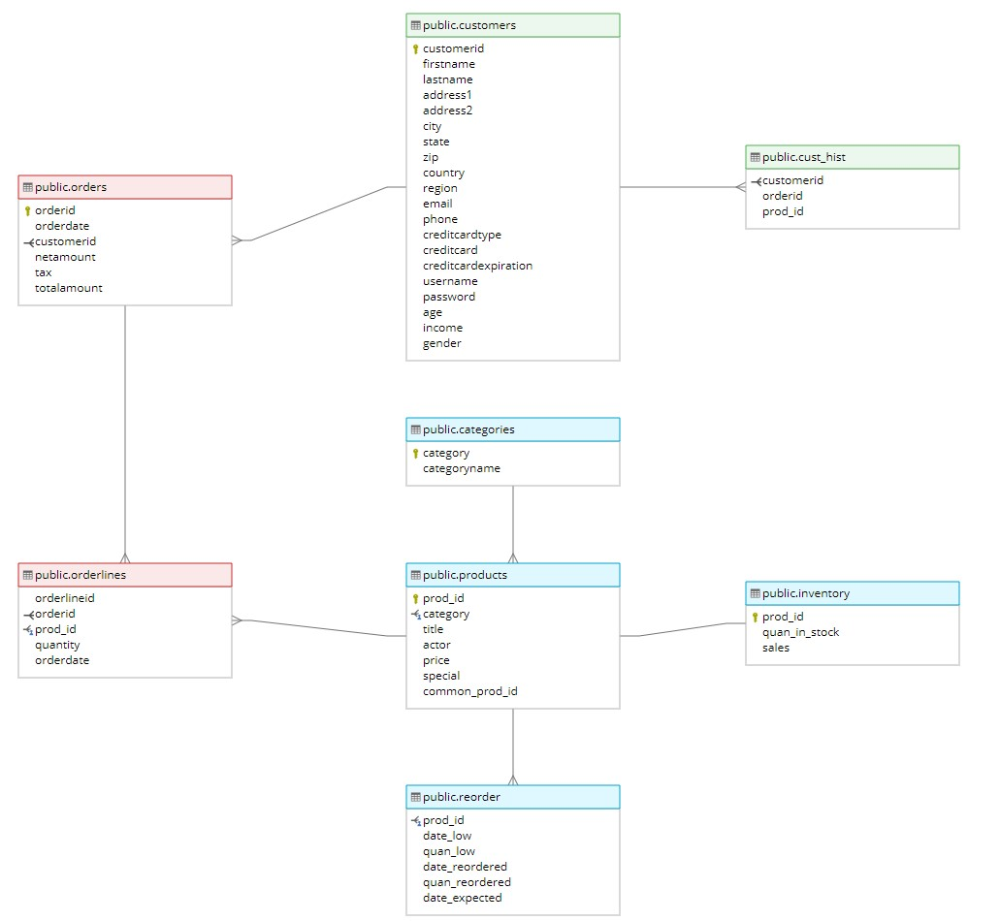

# Sample-service
Golang CRUD service for DVD store that communicates by GRPC and follows the principles of [Clean Architecture](http://blog.cleancoder.com/uncle-bob/2012/08/13/the-clean-architecture.html "Clean Architecture") by Robert Martin.

It has simplified business logic in order to concentrate on architecture, code organization and practicing GRPC.

## Project structure
Project structure (mostly) follows [Standard Go Project Layout](https://github.com/golang-standards/project-layout "Standard Go Project Layout").

- `/cmd` - entry point of the app
- `/config` - configuration
- `/internal/dvdstore`  - application code (interfaces, transports, implementations)
- `/internal/dvdstore/grpc` -  GRPC transport
- `/internal/dvdstore/repository` - working with repositories, currently only postgresql
- `/internal/dvdstore/usecase` - business logic
- `/internal/models` - entities, exported errors, custom validations
- `/internal/server` - initialization of the app ("continues" main.go)
- `/pkg/postgres` - postgres connection config
- `/proto` - protobuf definition and proto-generated code

To follow dependency inversion, use cases and repositories are described through interfaces.  
Concrete repository implementations realize communication with needed data sources, in this project it is postgresql.  
Concrete use case implementations aggregate repository interface; transport (grpc) aggregates use case interface.  
Such code organization simplifies unit testing and allows us to make code flexible - we can easily add/switch between data sources and transports, write different use cases.

### Request processing logic
Transport receives request from client and calls use case. Use case validates the request and calls repository. Repository retrieves data from data source and forms entity. Entity is mapped to response structure and returned to client with status code. If any error appears, the app returns corresponding error with error code.

### DB schema
Project uses [Dell DVD store](https://linux.dell.com/dvdstore/ "Dell DVD store") database:



Some of the tables are ignored to simplify the business logic.

## Running and usage
```bash
# Build and start container with database
docker compose up -d

# Load dependencies
go mod tidy

# Run the app
go run cmd/main.go
```

If everything is ok, you will see this message: 
```bash
{"level":"info","msg":"GRPC listening on port 9090"}
```

### Usage
You can use any preferred GRPC client to call API, for example [grpcurl](https://github.com/fullstorydev/grpcurl "grpcurl") or [Postman](https://blog.postman.com/postman-now-supports-grpc/ "Postman").  
Service uses reflection, so you can describe it through the client.

```bash
# describe service
grpcurl -plaintext localhost:9090 describe

# describe message 
grpcurl -plaintext localhost:9090 describe proto.GetCustomerReq

# request customer orders
grpcurl -d '{"CustomerID": 268}' -plaintext localhost:9090 proto.Dvdstore/GetCustomerOrders
```
Though I recommend to use Postman.
## API methods

- [Customers](#customers)
  - [GetCustomers](#getcustomers)
  - [GetCustomer](#getcustomer)
  - [AddCustomer](#addcustomer)
  - [DeleteCustomer](#deletecustomer)
- [Products](#products)
  - [GetProducts](#getproducts)
  - [GetProduct](#getproduct)
  - [AddProduct](#addproduct)
  - [DeleteProduct](#deleteproduct)
- [Orders](#orders)
  - [GetOrder](#getorder)
  - [GetCustomerOrders](#getcustomerorders)
  - [AddOrder](#addorder)
  - [DeleteOrder](#deleteorder)

### Customers
#### GetCustomers
GetCustomers returns list of all Customers limited by provided limit
<table>
<tr> <th> Request </th> <th> Response </th> </tr>
<tr>
<td>
  
```json
{
    "Limit": 2
}
```
  
</td>
<td>
  
```json
{
    "CustomerList": [
        {
            "Id": "2",
            "FirstName": "HQNMZH",
            "LastName": "UNUKXHJVXB",
            "Age": "80"
        },
        {
            "Id": "3",
            "FirstName": "JTNRNB",
            "LastName": "LYYSHTQJRE",
            "Age": "47"
        }
    ]
}
```
  
</td>
</tr>
</table>

#### GetCustomer
GetCustomer returns Customer by provided id
<table>
<tr> <th> Request </th> <th> Response </th> </tr>
<tr>
<td>
  
```json
{
    "CustomerID": 268
}
```
  
</td>
<td>
  
```json
{
    "Customer": {
        "Id": "268",
        "FirstName": "MKZPVX",
        "LastName": "CBIHNABLQI",
        "Age": "54"
    }
}
```
  
</td>
</tr>
</table>

#### AddCustomer
AddCustomer adds passed Customer and returns his id. Passed customer "Id" field is ignored
<table>
<tr> <th> Request </th> <th> Response </th> </tr>
<tr>
<td>
  
```json
{
    "Customer": {
        "Age": 30,
        "FirstName": "John",
        "LastName": "Doe"
    }
}
```
  
</td>
<td>
  
```json
{
    "CustomerID": "20003"
}
```
  
</td>
</tr>
</table>

#### DeleteCustomer
DeleteCustomer deletes Customer by provided id. Returns empty response if no errors were met
<table>
<tr> <th> Request </th> <th> Response </th> </tr>
<tr>
<td>
  
```json
{
    "CustomerID": 16
}
```
  
</td>
<td>
  
```json
{}
```
  
</td>
</tr>
</table>

### Products
#### GetProducts
GetProducts returns list of all Products limited by provided limit
<table>
<tr> <th> Request </th> <th> Response </th> </tr>
<tr>
<td>
  
```json
{
    "Limit": 2
}
```
  
</td>
<td>
  
```json
{
    "ProductList": [
        {
            "Id": "1",
            "Title": "ACADEMY ACADEMY",
            "Price": 25.99,
            "Quantity": "138"
        },
        {
            "Id": "2",
            "Title": "ACADEMY ACE",
            "Price": 20.99,
            "Quantity": "118"
        }
    ]
}
```
  
</td>
</tr>
</table>

#### GetProduct
GetProduct returns Product by provided id
<table>
<tr> <th> Request </th> <th> Response </th> </tr>
<tr>
<td>
  
```json
{
    "ProductID": 17
}
```
  
</td>
<td>
  
```json
{
    "Product": {
        "Id": "17",
        "Title": "ACADEMY ALONE",
        "Price": 28.99,
        "Quantity": "114"
    }
}
```
  
</td>
</tr>
</table>

#### AddProduct
AddProduct adds passed Product and returns his id. Passed product "Id" field is ignored
<table>
<tr> <th> Request </th> <th> Response </th> </tr>
<tr>
<td>
  
```json
{
    "Product": {
        "Price": 10.55,
        "Quantity": 6,
        "Title": "Product"
    }
}
```
  
</td>
<td>
  
```json
{
    "ProductID": "10006"
}
```
  
</td>
</tr>
</table>

#### DeleteProduct
DeleteProduct deletes Product by provided id. Returns empty response if no errors were met
<table>
<tr> <th> Request </th> <th> Response </th> </tr>
<tr>
<td>
  
```json
{
    "ProductID": 58
}
```
  
</td>
<td>
  
```json
{}
```
  
</td>
</tr>
</table>

### Orders
#### GetOrder
GetOrder gets order by provided id
<table>
<tr> <th> Request </th> <th> Response </th> </tr>
<tr>
<td>
  
```json
{
    "OrderID": 54
}
```
  
</td>
<td>
  
```json
{
    "Order": {
        "Id": "54",
        "Date": {
            "seconds": "1074124800"
        },
        "NetAmount": 311.01,
        "Tax": 25.66,
        "TotalAmount": 336.67,
        "ProductList": [
            {
                "Id": "5787",
                "Title": "AGENT SHINING",
                "Price": 9.99,
                "Quantity": "3"
            }
        ]
    }
}
```
  
</td>
</tr>
</table>

#### GetCustomerOrders
GetCustomerOrders returns customer orders by provided customer id
<table>
<tr> <th> Request </th> <th> Response </th> </tr>
<tr>
<td>
  
```json
{
    "CustomerID": 359
}
```
  
</td>
<td>
  
```json
{
    "OrderList": [
        {
            "Id": "7453",
            "Date": {
                "seconds": "1091836800"
            },
            "NetAmount": 124.11,
            "Tax": 10.24,
            "TotalAmount": 134.35,
            "ProductList": [
                {
                    "Id": "7114",
                    "Title": "AIRPORT CAMELOT",
                    "Price": 9.99,
                    "Quantity": "3"
                }
            ]
        }
    ]
}
```
  
</td>
</tr>
</table>

#### AddOrder
AddOrder adds order for passed customer id with provided products and returns created order id.  
"Title" and "Price" fields in passed ProductList are ignored
<table>
<tr> <th> Request </th> <th> Response </th> </tr>
<tr>
<td>
  
```json
{
    "CustomerID": 36,
    "ProductList": [
        {
            "Id": 34,
            "Quantity": 2
        },
         {
            "Id": 92,
            "Quantity": 10
        }
    ]
}
```
  
</td>
<td>
  
```json
{
    "OrderID": "12010"
}
```
  
</td>
</tr>
</table>

#### DeleteOrder
DeleteOrder deletes order with provided order id. Returns empty response if no errors were met
<table>
<tr> <th> Request </th> <th> Response </th> </tr>
<tr>
<td>
  
```json
{
    "OrderID": 14
}
```
  
</td>
<td>
  
```json
{}
```
  
</td>
</tr>
</table>